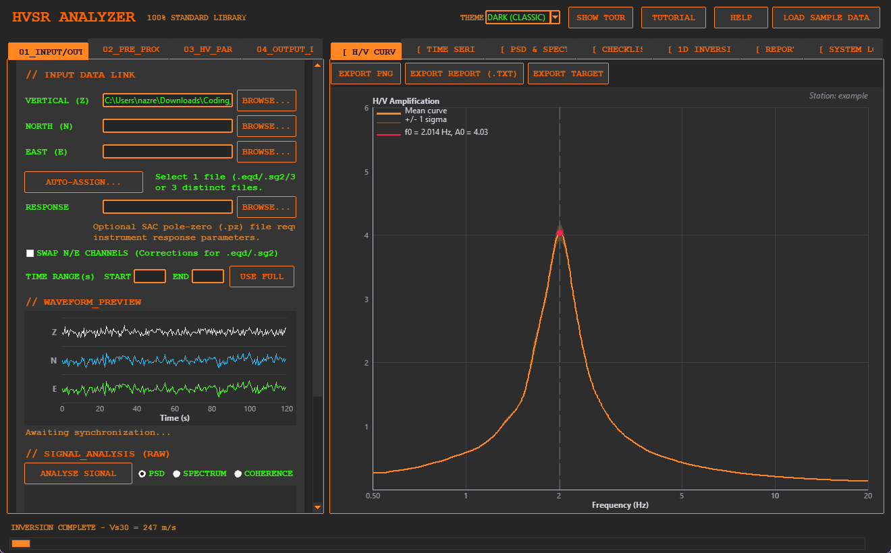
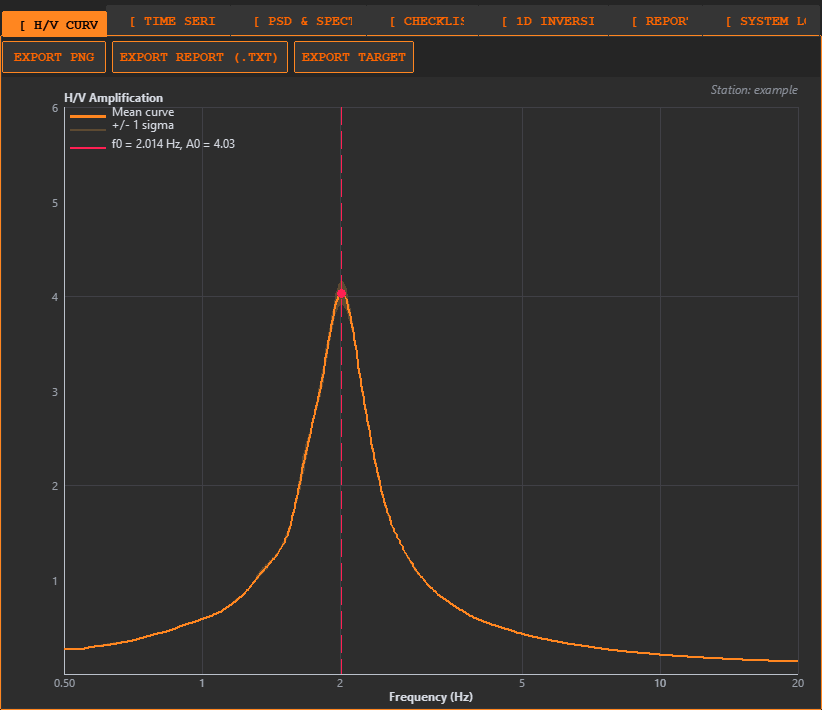
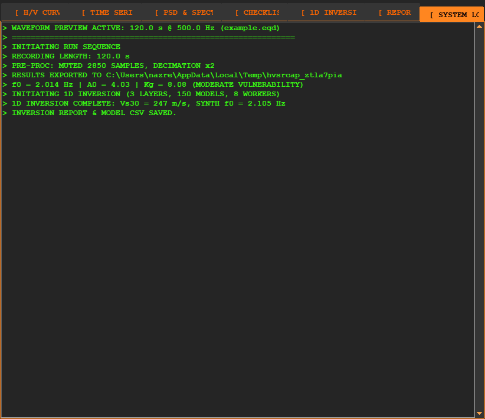
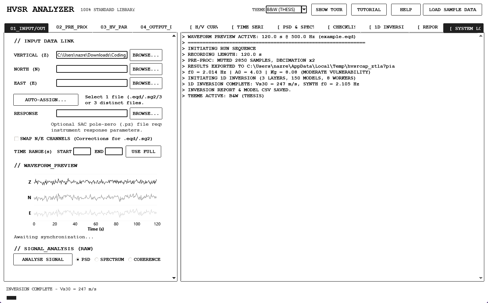
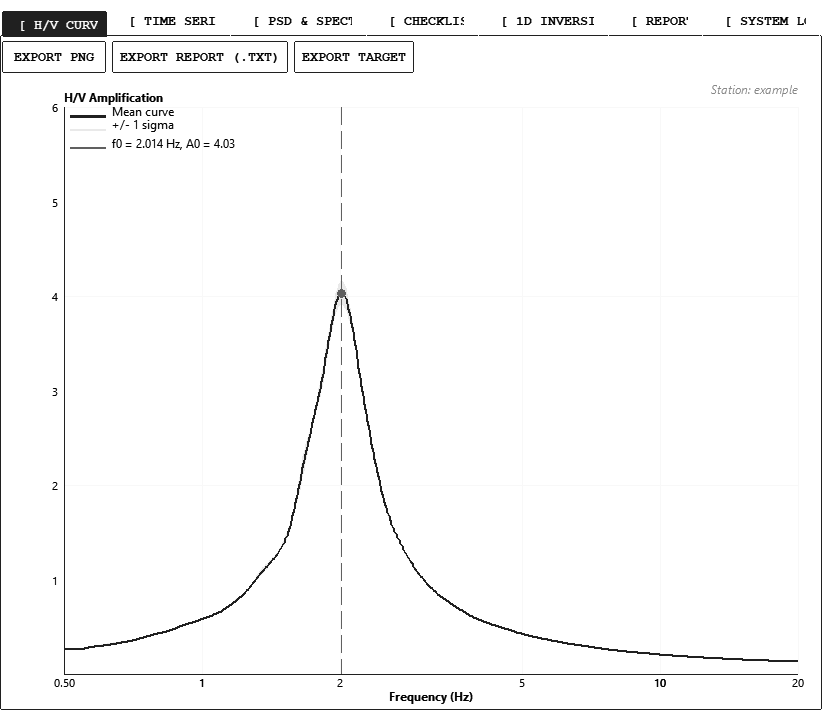
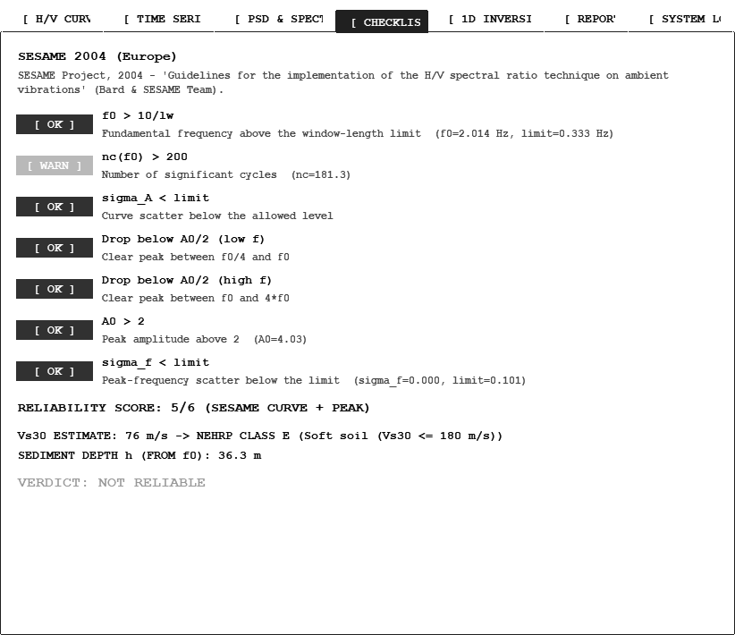
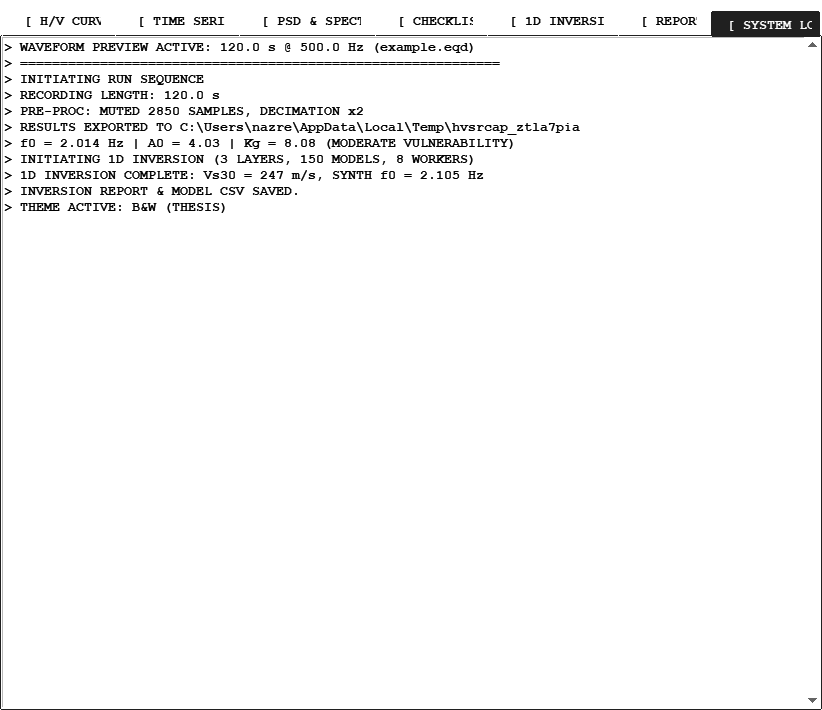
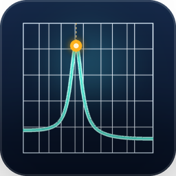

# HVSR Analyzer

[](https://github.com/NazreenNasyuha/HVSR_Analyzer/actions/workflows/build-installer.yml)

A complete, **pure-Python** desktop application for **Horizontal-to-Vertical
Spectral Ratio (HVSR)** microtremor analysis — rebuilt from scratch with
**zero third-party packages**. No numpy, no scipy, no obspy, no hvsrpy, no
matplotlib. Everything runs on the Python standard library.

It is a from-scratch re-implementation of the original
Nazreen script, with a real GUI, batch
processing, built-in charts, an installer **and a built-in 1D inversion**.

**New here? Start with the [First-Time User Tutorial](docs/TUTORIAL.md)** — it
walks you through the whole workflow using the bundled example signals in
`examples/` (`.eqd`, miniSEED and SEG-2), no field data required.

On first launch the program shows a **guided tour** — a spotlight with a box
+ arrow highlights each control one by one and explains what it does.  Press
the **SHOW TOUR** button in the header (or set `HVSR_TOUR=1` when starting)
to replay it at any time.

## Screenshots

The app ships with **two themes**: the default retro **dark** look and a
**Black & White (Thesis)** theme designed for print publication — white
backgrounds, black lines and grayscale colour maps. Switching themes
restyles every control *and* every exported PNG.

### Dark theme (default)






### Black & White (Thesis) theme







Screenshots are regenerated with `python scripts/make_screenshots.py` (captures
both themes in one run).

## Repository layout

```
HVSR_Analyzer/
├── src/                  # application source (engine, DSP, I/O, GUI, inversion)
│   ├── main.py            # entry point
│   ├── hvsr_gui.py        # tkinter application
│   ├── hvsr_theme.py      # dark / black & white theme palettes
│   ├── hvsr_engine.py     # windowed H/V analysis, SESAME, auto-tune
│   ├── hvsr_dsp.py        # FFT, filters, smoothing, STA/LTA
│   ├── hvsr_standards.py  # SESAME / Japan / Indonesia / USGS / Generic
│   ├── hvsr_inversion.py  # 1D Monte-Carlo inversion
│   ├── hvsr_io.py         # format routing (text/CSV, miniSEED, .eqd, .sg2)
│   ├── mseed_io.py        # pure-Python miniSEED reader
│   ├── eqd_io.py          # pure-Python .eqd reader
│   ├── sg2_io.py          # pure-Python SEG-2 reader
│   ├── hvsr_geopsy.py     # optional Geopsy cross-check
│   ├── hvsr_plot.py       # Canvas chart widgets
│   ├── chart_render.py    # pure-Python PNG encoder + rasterizer
│   └── make_sample_data.py# synthetic 2 Hz test-station generator
├── tests/                 # unit + GUI test suites (see Testing)
├── scripts/               # development / validation tools (Geopsy & Dinver
│                          #   cross-checks, parameter sweeps, E2E pipeline,
│                          #   example-signal + screenshot generators)
├── examples/              # 3 example signals (.eqd, miniSEED trio, .sg2)
├── docs/                  # first-time-user tutorial + screenshots
├── installer/             # Inno Setup script -> HVSR_Analyzer_Setup.exe
├── CHANGELOG.md           # version history (1.0.0)
├── run.bat                # Windows launcher
├── README.md
└── LICENSE               # MIT License
```

---

## 0. Project specification

> This section is the functional contract of the program. Features not listed
> here are not part of the specification.

The program must:

1. **Input any available HVSR signal type file** — one 3-column text/CSV
   file, three single-component text files, three miniSEED files
   (`.mseed`/`.miniseed`), one `.eqd` raw recording, or one SEG-2
   (`.sg2`) file. An optional SAC pole-zero (`.pz`) response file is also
   accepted.
2. **Assign the components (North, East, Vertical) automatically** (from
   the SEG-2 `NOTE` field, file names, or channel order), **with a manual
   override** ("Swap N / E") when the automatic assignment is wrong.
3. **Window size**: user-selectable **and** recommended automatically
   (Auto mode / Apply-Method / auto-tune).
4. **Automatic selection based on initial time and final time** — the user
   types a Start (s) and End (s); the analysis then uses only that part of
   the recording. Leaving both empty uses the whole recording.
5. **Filter**: manually insertable (band-pass edges, order, prototype:
   Butterworth / Chebyshev-I / Bessel) **and** recommended automatically.
6. **Frequency band** (fmin / fmax of the H/V curve): manually insertable
   **and** recommended automatically.
7. **Smoothing**: choose from the four recommended operators —
   **Konno-Ohmachi**, **moving average**, **triangular constant**,
   **triangular proportional** — with an adjustable width, plus automatic
   recommendations.
8. **Sum type of the horizontal components**: choose **arithmetic mean**,
   **geometric mean**, or **mean square** (quadratic).
9. **Show the reliability (checklist) and the peak according to the SESAME
   guideline formulas**, with the ability to **automatically change the
   parameters to get the most reliable result** (auto-tune: window,
   rejection, smoothing, width, H/V formula — driven by the SESAME score).
10. **Output the H/V graph with f0 and A0 displayed** (on-chart marker and
    legend, PNG export, text report).
11. **1D inversion**: starting from the H/V graph, build a layered soil
    model automatically (model seeded from f0 / A0 / Vs30), run a
    Monte-Carlo inversion against the theoretical Rayleigh-wave
    ellipticity, and report **the depth and Vs of each layer**, Vs30 and
    the resulting **soil type** (NEHRP and SNI site classes).
12. **Everything automatic is based on published guidelines**: SESAME 2004
    (Europe), Japan (J-SHIS / JAMC), **Indonesia (SNI 1726-2019 / BMKG)**,
    USGS / NEHRP and a Generic industry checklist.

Implementation status: **all of the above is implemented** (see the
feature table below).

---

## What the program does

1. **Loads** the three components of a microtremor recording
   (Vertical Z, North N, East E) from any of these:
   - one 3-column text/CSV file,
   - three separate single-component text files,
   - three **miniSEED** files (`.mseed` / `.miniseed`) — a from-scratch
     reader supporting 16/24/32-bit int, float32/float64 and STEIM-1/2
     encodings, both byte orders, and the non-standard Guralp variant
     produced by the field conversion tooling (validated sample-for-sample
     against ObsPy, correlation 1.0),
   - one **`.eqd`** raw recording (3 interleaved 16-bit channels at
     500 Hz, reverse-engineered from field microtremor recordings),
   - one **SEG-2 (`.sg2`)** file — the SeisPrb output format that holds all
     three traces in a single file. The Z / N / E component of each trace
     is detected **automatically** from its `NOTE` field (e.g.
     `E1000253.N`), with a manual **Swap N / E** override in the GUI.
     Validated sample-for-sample against ObsPy (correlation ~1.0),
   plus an optional SAC pole-zero instrument response (`.pz`) file.
2. **Selects the time range** (Start / End in seconds) — empty fields use
   the full recording; the length of the loaded recording is logged.
3. **Pre-processes** the data:
   - instrument response de-convolution (pole-zero spectral division),
   - linear detrending + demeaning,
   - 5th-order Butterworth band-pass filter (bilinear transform,
     zero-phase; Chebyshev-I and Bessel prototypes also available) with an
     STA/LTA transient muting step,
   - optional integer decimation when the sampling rate exceeds 200 Hz.
4. **Computes the H/V spectral ratio** with a sliding window:
   - cosine taper (default 5%),
   - FFT of every window (radix-2 + Bluestein, written from scratch),
   - selectable spectral smoothing: **Konno-Ohmachi** (b-value, default
     40), **moving average**, **triangular constant** or **triangular
     proportional**, at 512 log-spaced frequencies,
   - arithmetic / geometric / mean-square combination of the two
     directional ratios,
   - iterative window rejection (mean +/- n·sigma, log domain).
5. **Evaluates the SESAME 2004 reliability criteria** (7 checks) plus the
   checklists of the other selected guidelines (Japan J-SHIS/JAMC,
   **Indonesia SNI 1726-2019**, USGS/NEHRP, Generic), the seismic
   vulnerability index **Kg = A0²/f0**, and a **Reliability score (x/6)**
   shown in the checklist tab.
6. **Exports**:
   - a full text report,
   - an inversion target file (`freq  amp  stddev`),
   - a PNG chart of the H/V curve (rendered by the built-in rasterizer).
7. **Auto-tunes** the processing parameters for the most reliable result:
   - quick: window length x rejection factor (SESAME score),
   - **max reliability**: additionally sweeps the smoothing operator, its
     width and the H/V combination, and writes the winning parameters back
     into the fields.
   The sweeps reuse the computed window spectra, run on all CPU cores by
   default, and show a **live progress bar with an ETA** — the
   `HVSR_WORKERS` environment variable caps the parallelism (set it to
   `1` to force sequential mode).
8. **Optionally cross-checks** the result with the external *Geopsy*
   program (`geopsy-hv.exe`) if it is installed on the machine.
9. **1D inversion** (new): inverts the H/V curve into a layered Vs model —
   see the dedicated section below.
10. **Interactive signal previews** (new): three on-demand viewers let
    you inspect the data *before* committing to a full run -
    - *Input & Output*: **Analyse signal** plots the raw waveform's PSD,
      Fourier spectrum, and the coherence of the Z-N / Z-E / N-E pairs;
    - *Preprocessing*: **Preview filtered waveform** shows the filtered +
      muted traces with the analysis window overlaid;
    - *HV Parameters*: **Show H/V views** renders time-frequency and
      azimuth-frequency H/V colour maps (with legends), the average
      component spectra and the average H/V curve.
    All previews run in background threads against a capped 120-second
    excerpt of the signal so they stay responsive on long recordings.
11. **Switchable themes**: the whole application - window chrome, left
    workflow pages, right result tabs and every chart canvas - is themed
    end-to-end, with a **theme selector in the header**:
    - **Dark** (default): the retro black / neon terminal look.
    - **Black & White (Thesis)**: a high-contrast white / black / grey
      theme designed to be printed in a thesis or journal (white
      backgrounds, black lines, grey shading, grayscale colour maps).
    Every widget follows the active theme: notebook tabs, scrollbars, the
    notebook frame, the status progress bar, buttons and entry fields all
    match, with the `clam` theme's default light-gray borders and white
    active-state highlights explicitly overridden - no theme remnants
    ever show through.  The exported PNG charts are rasterized with the
    same active palette (see `hvsr_theme.py`), so saved images match the
    on-screen look.

## How it differs from the original script (and why it is better)

| Original (Nazreen Script) | New program |
|---|---|
| Hard-coded machine paths | Paths chosen in the GUI via pop-up dialogs; Geopsy auto-detected |
| Terminal + single file dialog, no interface | Full tkinter GUI with parameter control, charts, reports |
| Requires `obspy`, `hvsrpy`, `sigpropy`, `numpy`, `scipy`, `matplotlib` | Pure standard library — runs anywhere Python 3 runs |
| Reads only `.sg2/.mseed/.saf` (via obspy) | Reads text/CSV, miniSEED (incl. STEIM + the Guralp variant), `.eqd` and SEG-2 `.sg2` (components auto-detected) |
| Single station per run | Single-station **and** batch folder processing (incl. `.mseed`/`.eqd`/`.sg2`) |
| Hard-coded 2000 s plot window, matplotlib-only plots | Responsive Canvas charts + built-in PNG export |
| `sys.exit()` on every problem | Graceful error handling in the GUI |
| Fixed `sigma_f` estimate | Per-window f0 scatter, parabolic peak interpolation |
| No parameter exposure | All processing parameters adjustable live **or** filled automatically |
| Always saves, fixed location | Choose what to save, where, or let it auto-save; automatic data-log CSV |
| Fixed Konno-Ohmachi smoothing only | Four selectable smoothing operators + widths |
| No time-range selection | Start / End time selection (empty = full recording) |
| No reliability optimization | SESAME-score auto-tune (quick **and** full "max reliability" sweep) |
| No inversion | **Built-in 1D inversion** (Rayleigh ellipticity + Monte-Carlo) |
| Light/generic look | Full retro dark theme **and** a black & white thesis theme (every widget + charts + PNG exports, zero theme remnants) |

## Files

| File | Purpose |
|---|---|
| `src/main.py` | entry point (`python src/main.py` or double-click `run.bat`) |
| `run.bat` | Windows launcher (calls `src/main.py`) |
| `src/hvsr_gui.py` | tkinter application (UI + threading + batch + inversion tab) |
| `src/hvsr_tour.py` | guided first-run tour overlay (box + arrow, step-by-step) |
| `src/hvsr_theme.py` | theme palettes (dark + black & white) shared by the GUI, charts and PNG export |
| `src/hvsr_plot.py` | Canvas chart widgets (H/V, time series, spectra, **Vs profile**, **misfit histogram**) |
| `src/hvsr_engine.py` | windowed H/V analysis, SESAME, **time-range trim**, **auto-tune (quick + full)**, exports |
| `src/hvsr_dsp.py` | from-scratch FFT, filters, smoothing (4 operators), STA/LTA, PZ |
| `src/hvsr_standards.py` | guideline standards: **SESAME / Japan / Indonesia (SNI 1726-2019) / USGS / Generic**, thickness & Vs30 relations, NEHRP + SNI site classes |
| `src/hvsr_inversion.py` | **1D inversion**: Rayleigh-ellipticity forward model (CPS surf96/swegn96 port) + Monte-Carlo inversion, Vs30, soil types, report/CSV |
| `src/hvsr_io.py` | text/CSV + miniSEED + `.eqd` + `.sg2` loading (format routing) |
| `src/mseed_io.py` | pure-Python miniSEED reader (int/float/STEIM, both byte orders) |
| `src/eqd_io.py` | pure-Python `.eqd` 3-component reader |
| `src/sg2_io.py` | pure-Python SEG-2 (`.sg2`) reader with auto component detection |
| `src/hvsr_geopsy.py` | optional Geopsy cross-check |
| `src/chart_render.py` | pure-Python PNG encoder + rasterizer + bitmap font (H/V, spectra, **Vs profile + misfit histogram panel**) |
| `src/make_sample_data.py` | generates a synthetic test station (2 Hz resonance) — also the basis of the `examples/` signals |
| `tests/test_engine.py` | 24 unit tests (`python tests/test_engine.py`) |
| `tests/test_io.py` | 8 round-trip tests for the miniSEED / `.eqd` / `.sg2` readers |
| `tests/test_extras.py` | 62 second-wave tests: STEIM, encodings, round-trips, standards (incl. Indonesia), rejection, routing, Geopsy params, chart exports + dark palette + B&W (thesis) palette checks + bundled example-signal round-trips + FFT/smoothing/parallel-equivalence checks + worker-env override |
| `tests/test_gui.py` | 100 automated GUI tests (window withdrawn; dialogs patched) |
| `tests/test_inversion.py` | 19 tests for the 1D inversion (forward model vs analytic results, inversion recovery, trim, auto-tune, Indonesia, **ensemble uncertainty + misfit histogram**) |
| `examples/` | 3 example signals (`.eqd`, miniSEED trio, `.sg2`) with a known 2 Hz resonance — used by the tutorial |
| `docs/TUTORIAL.md` | step-by-step first-time-user guide |
| `CHANGELOG.md` | version history (current version: 1.0.0) |
| `docs/screenshots/` | B&W (Thesis) theme screenshots for the README |
| `scripts/make_examples.py` | regenerates + validates the example signals |
| `scripts/make_screenshots.py` | captures the B&W screenshots (needs Pillow + a display) |
| `scripts/` | development / validation tools (`compare_geopsy.py`, `e2e_all.py`, `sweep_b.py`, etc.) |
| `installer/HVSR_Analyzer_Setup.iss` | Inno Setup installer script |
| `installer/make_icon.py` | regenerates the application icon (`HVSR_Analyzer.ico` / `.png`) |
| `.github/workflows/build-installer.yml` | CI: runs tests and builds the installer on push / PR / release tag |

## Quick start

```
python src/main.py        # or double-click run.bat
```

**First time? The guided tour walks you through the interface on launch**
(box + arrow highlights, Next / Back / Skip), and the written
[Tutorial](docs/TUTORIAL.md) explains the full workflow - both use the
example signals in `examples/` (.eqd, miniSEED, .sg2), all with a known
2 Hz resonance, so you can verify the whole pipeline without any field
data.

The left panel is a **4-step workflow** (tabs 1-4); the right panel
shows the results tabs.  The interface opens in the **dark theme**
(black panels, bright accents) so it stays comfortable to read in the
field or in a dark office, and the **THEME** selector in the header
switches to the **Black & White (Thesis)** look at any time - the theme
covers every control (tabs, scrollbars, buttons, entry fields and the
progress bar) with no theme remnants.

1. **Tab 1 - Input & Output**: pick the signal files with the *Browse...*
   buttons (pop-up dialogs):
   - one `.eqd` or `.sg2` file (a single `.sg2` holds all three traces;
     Z / N / E are detected automatically, tick **Swap N / E** if the
     curve looks wrong), or a three-column text file, or
   - the three `.mseed` / text component files (Z, N, E),
   - or click **Auto-assign files...** and pick **either 1 file** (a
     single `.eqd` / `.sg2` / 3-column text file) **or 3 files** (Z / N /
     E, matched by name) in one dialog - the slots fill themselves.
   The **waveform preview** at the bottom of this tab draws the raw
   traces of the assigned files as soon as they load, so you can confirm
   each component (Z / N / E) landed in the right slot.
   Press **Analyse signal** to see the *power spectrum* (Welch PSD), the
   *Fourier amplitude spectrum*, or the *coherence* of the three
   component pairs (Z-N, Z-E, N-E) of the raw waveform - the mode
   selector switches between the three views, and **Export PNG** saves
   the current view.
   Choose the optional time range (Start / End s, or **Use full**) and
   the output folder (*Save to*, or leave empty for an auto-created
   `HVSR_Results`).
2. **Tab 2 - Preprocessing**: band-pass edges, STA/LTA transient muting
   (STA/LTA/trigger), decimation rate.
   Press **Preview filtered waveform** to run the pre-processing on the
   loaded signal and draw the cleaned Z / N / E traces with the analysis
   window (green) overlaid; the window length field lets you adjust the
   sliding window and see exactly what the H/V calculation will use, and
   **Export PNG** saves the preview.
3. **Tab 3 - HV Parameters**: in **Manual** mode every engine setting is
   editable (window, overlap, rejection, frequency range, log samples,
   **smoothing operator + width**, KO b-value, taper, rejection
   iterations, **H/V formula**: geometric / quadratic / arithmetic).
   Press **Apply Method recommendations** to fill all fields from the
   selected method (SESAME 2004 / Japan / **Indonesia** / USGS / Generic)
   and then tweak any of them, or switch to **Auto (suggest)** and the
   program fills the window length, rejection and band-pass from the data
   automatically (SESAME-score tuning).  For **Reliability**, tick
   *Auto-tune window & rejection* for a quick search, or press
   **Auto-tune for max reliability (full sweep)...** to also search
   smoothing, width and H/V formula and write the winning parameters
   back into the fields (the Method Checklist tab shows the SESAME
   matrix with a **Reliability score (x/6)**).
   Press **Show H/V views** for an interactive preview of the four
   analysis charts (drawn with the current parameters, without saving):
   a *time-frequency* H/V map and an *angle (azimuth) - frequency* map,
   both with a colour legend, plus the *average spectra* of the three
   components and the *average H/V curve*.  **Export PNG** saves all four
   views as `*_timefreq.png`, `*_azimuth.png`, `*_spectra.png` and
   `*_curve.png`.  The **Parameter profile** row here lets you **Save...**
   every parameter field to a JSON file and **Load...** it back later,
   so a tuned setup (method, windows, smoothing, muting, decimation) can
   be reused or shared between machines.  (The input time range and the
   output-file checkboxes are intentionally not part of the profile - it
   stores the analysis parameters only.)
4. **Tab 4 - Output Data**: tick Report / Target / Chart PNG / Data CSV,
   and either save into the chosen output folder automatically or tick
   *Ask me where to save each result*. The automatic **data-log CSV**
   (`data_log.csv`) records every run (station, f0, A0, Kg, parameters).
   Optional extras: PSD & spectra computation, Geopsy cross-check.
5. Press **Run Analysis** (or **Batch process folder...**).
6. Inspect the *H/V Curve* (f0 / A0 marked), *Time Series*, *PSD &
   Spectra*, *Method Checklist* and *Report* tabs.

## 1D inversion (the new feature)

The **1D Inversion** tab turns the measured H/V curve into a layered
shear-wave velocity (Vs) model — the standard workflow that is
normally done with Dinver/Geopsy.

How it works (all pure standard library):

1. **Automatic model seeding from the H/V graph**: the picked f0 sets the
   first-layer thickness via the quarter-wavelength rule
   `h1 ~ Vs1 / (4 f0)`, the Vs30 estimate anchors the velocity level, and
   deeper layers get progressively larger thicknesses and velocities
   (Vp from Vs via Poisson's ratio, density from Vp via Brocher 2005).
2. **Forward model**: the theoretical H/V of a layered model is the
   surface ellipticity of the fundamental-mode Rayleigh wave, computed
   from scratch with the **Thomson-Haskell / Dunkin (1965) delta-matrix
   algorithm** — the same algorithm as Herrmann's Computer Programs in
   Seismology `surf96` / `swegn96` (and the `disba` package) — ported to
   the standard library.  It reproduces the analytic half-space
   ellipticity (|ux/uz| = 0.6815 for nu = 0.25) and the
   quarter-wavelength resonance peaks exactly.
3. **Monte-Carlo inversion**: hundreds of random layered models are drawn
   around the seed (Vs and thickness in log-uniform bands, optional "Vs
   increases with depth" constraint), each is compared with the observed
   curve on a log-spaced band around f0 (0.5-2 x f0) using a log-domain
   L2 misfit with the synthetic peak scaled to the observed amplitude
   (standard HVSR-inversion practice), and the best-fitting models are
   averaged into the final profile.
4. **Outputs**:
   - a layer table: **top / bottom depth, Vs, Vp, density and soil class**
     for every layer plus the half-space,
   - **Vs30** (harmonic mean over the top 30 m) with **NEHRP** and
     **SNI 1726-2019** site classes,
   - a Vs-versus-depth profile chart (PNG export available),
   - `station_inversion_report.txt` and `station_inversion_model.csv`
     saved into the output folder,
   - the synthetic H/V f0 for comparison with the observed f0,
   - **ensemble uncertainty**: the accepted models are kept as an
     ensemble and every layer gets its **P16 / P84 range for Vs and
     thickness** (the usual +/-1 sigma lognormal bounds), plus the misfit
     distribution (best / median / P90).  The ranges are drawn as shaded
     bands on the Vs profile and written into the report and the CSV
     (`vs_p16`, `vs_p84`, `thk_p16`, `thk_p84` columns),
   - **misfit histogram**: all finite model misfits are binned into a
     histogram drawn below the Vs profile in the 1D Inversion tab (with
     best / median / P90 markers) and on the exported profile PNG.

Controls: number of layers (1-6), number of iterations, Poisson's ratio,
and the monotonicity constraint.  The Monte-Carlo search runs across all
CPU cores by default (capped by the `HVSR_WORKERS` environment variable)
with a **live progress bar and ETA**; the run happens in the background so
the UI stays responsive.

*Validation note:* on the bundled synthetic 2 Hz station the inversion
recovers a top-layer Vs close to the true 300 m/s and a Vs30 ~ 316 m/s
(site class D / SD), with the synthetic peak within ~10% of the observed
f0 — see `test_inversion.py`.

*Real-data check:* `python scripts/e2e_all.py` runs the whole pipeline
(SEG-2 load -> time trim -> preprocess -> H/V analysis -> reliability
-> 1D inversion with uncertainty) on every recording listed in the
script's `STATIONS` table and writes per-station reports/CSVs/PNGs plus
`all_stations_summary.csv`.  In the validation runs the basin stations
were consistently soft alluvium (f0 ~ 1.6-1.8 Hz, Vs30 275-345 m/s,
NEHRP D / SNI SD), with firmer sites (Vs30 ~ 408 m/s, C/SC) and one
high-frequency outlier (f0 ~ 5.3 Hz).  With the recommended 30 s windows
most stations score 5-6/6 on the SESAME curve criteria; the strict
window-count criterion (nc > 200) needs full-length recordings or the
auto-tune path (which reached RELIABLE 7/7 on the outlier).

*Dinver cross-validation:* `python scripts/compare_dinver.py` reads a
reference Dinver 5-layer parameterisation (`reference_5_layer_model.param`,
gzip tar + UTF-16 XML), inverts with 4 layers to mirror its 5-layer model,
and checks the result against the reference search bounds.  In the
validation runs the program's Vs30 fell **inside** the Dinver Vs30 range
for the basin stations, with 3/5 layers fully inside the official Vs
bounds (the deep half-space comes out ~10-20% softer than Dinver's
>= 800 m/s floor).  Report, CSV and an overlay PNG are written to
`HVSR_Results_E2E/dinver_comparison.*`.

## Signal data validation

The program was validated against a full field dataset (miniSEED, `.eqd`
and SEG-2 recordings):

```
python validate_all_signals.py
```

**Every file in the validation set was loaded with zero failures**, and the
stations analyse to a consistent site resonance of f0 ≈ 1.5-2.4 Hz (the
program reproduces the Geopsy reference value for the benchmark station).

## Batch processing

Pick a folder whose sub-folders are stations. Each sub-folder may contain a
`.mseed` trio, one `.eqd`, one `.sg2`, one 3-column file or three component
files. The program analyses every station, saves the enabled outputs and
appends every result to the data-log. The time-range fields (if set) apply
to every station.

## Installer



The folder `installer` contains an [Inno Setup 6](https://jrsoftware.org/isinfo.php)
script that produces a professional single-file installer:

1. Download the free [Inno Setup 6](https://jrsoftware.org/isinfo.php).
2. Compile `installer/HVSR_Analyzer_Setup.iss` (open it in Inno Setup and press
   Compile, or run `ISCC.exe installer/HVSR_Analyzer_Setup.iss`).
3. The setup executable `HVSR_Analyzer_Setup.exe` is produced in
   `installer/Output/`.
4. Run it on the target machine.  Python 3.8+ is required; the installer
   detects Python during setup (registry and PATH) and warns if it is
   missing or too old.

The installer bundles the full application (source + launcher + icon + tests),
the first-time-user tutorial (`docs/TUTORIAL.md`), the three example signals
(`examples/`), shows the MIT license during installation, creates Start-menu
and optional desktop shortcuts with the application icon, and writes proper
version information and copyright metadata (© 2026 NazreenNasyuha).

The application icon is generated by `installer/make_icon.py` (a small
Pillow script that draws the log-frequency H/V curve and f0 peak).  Run it
again any time you want to re-render `installer/HVSR_Analyzer.ico` / `.png`:

```
pip install pillow
python installer/make_icon.py
```

### Continuous integration

A GitHub Actions workflow (`.github/workflows/build-installer.yml`) runs the
full test suite on every push and pull request, and builds the installer on
`windows-latest` using the pinned [Inno Setup 6.7.3](https://jrsoftware.org/isinfo.php)
compiler:

- **Push / pull request** — tests run; the installer is compiled and uploaded
  as a build artifact.
- **Version tag `v*`** — the same build runs and the setup executable is
  attached to the corresponding GitHub Release (with auto-generated notes).
- **Manual** — the workflow can also be triggered from the Actions tab.

To cut a release:

```
git tag v1.0.0
git push origin v1.0.0
```

The compiled setup (`.exe`) is then available on the release page — no local
Inno Setup install required.

## Testing

```
python tests/test_engine.py      # 24 engine tests (FFT, filters, KO, analysis,
                                 #   coherence, H/V time/azimuth maps, trimming)
python tests/test_io.py          # 8 reader round-trip tests
python tests/test_extras.py      # 62 extra tests (STEIM, standards incl. Indonesia,
                                 #   routing, timeseries/colormap chart export,
                                 #   dark + B&W theme palette checks, example signals)
python tests/test_gui.py         # 100 GUI tests (tkinter; window hidden)
python tests/test_inversion.py   # 19 tests: forward model vs analytic, inversion
                                 #   recovery, time-range trim, auto-tune, Indonesia
```

The engine tests cover the FFT (radix-2 and Bluestein against a brute-force
DFT), the Butterworth filter design, Konno-Ohmachi smoothing, STA/LTA,
pole-zero parsing, CSV loading and the full analysis (which must recover the
known 2 Hz resonance from synthetic data). The IO tests write synthetic
miniSEED, `.eqd` and SEG-2 `.sg2` files and read them back, including the
byte-order heuristic that handles the Guralp files and the component
auto-detection from SEG-2 `NOTE` fields. The inversion tests verify the
forward model against the analytic half-space ellipticity (0.6815 for
nu = 0.25) and quarter-wavelength peak positions, and run a real
Monte-Carlo inversion of the synthetic station.

## For developers

This project is **pure standard library on purpose** - no numpy, scipy,
obspy, matplotlib or any other third-party runtime dependency.  Keep it
that way: a new feature must work on a bare Python 3.8+ install.

### Architecture (where things live)

| Module | Responsibility |
|---|---|
| `src/main.py` | entry point; sets the first-run guided-tour flag |
| `src/hvsr_gui.py` | tkinter app: workflow pages, result tabs, worker threads, batch, inversion tab, tour wiring, progress bar |
| `src/hvsr_tour.py` | the guided first-run tour overlay (box + arrow, step-by-step callout card) |
| `src/hvsr_engine.py` | `preprocess` -> `analyze` -> SESAME scoring, `auto_tune` (cached + parallel), report/target exports |
| `src/hvsr_dsp.py` | FFT (radix-2 + Bluestein + real-input fast path), filters, 4 smoothing operators, STA/LTA, `resolve_workers` |
| `src/hvsr_inversion.py` | 1D Monte-Carlo inversion (parallel) with the Dunkin-matrix Rayleigh forward model |
| `src/hvsr_io.py` / `mseed_io.py` / `eqd_io.py` / `sg2_io.py` | format routing + from-scratch readers |
| `src/hvsr_standards.py` | SESAME / Japan / Indonesia (SNI 1726-2019) / USGS / Generic checklists + site classes |
| `src/hvsr_theme.py` / `hvsr_plot.py` / `chart_render.py` | palettes, Canvas charts, PNG rasterizer |
| `src/hvsr_geopsy.py` | optional external Geopsy cross-check |
| `scripts/` | dev tools: example/screenshot generators, E2E validation, Geopsy/Dinver comparisons |
| `tests/` | 5 suites - engine, io, extras, gui, inversion |

### Data flow

`auto_load()` (hvsr_io) -> `preprocess()` (hvsr_engine: detrend, band-pass,
STA/LTA mute, optional decimation) -> `analyze()` (sliding-window H/V ->
`_finalize_analysis`: rejection, mean curve, f0/A0, SESAME) ->
`invert_hvsr()` (hvsr_inversion: model seeding -> Monte-Carlo -> ensemble
stats).  The GUI runs these on daemon worker threads and ships results back
through a `queue.Queue` polled every 120 ms (`_poll_queue`).

### Performance notes

- **Window spectra are cached**: `auto_tune` computes each window's raw
  magnitude spectra once per window length and reuses them for every
  smoothing / width / combo combination, so the 32-combination
  max-reliability sweep costs roughly one FFT pass, not 32.
- **Real-input FFT**: `fft_real` computes an even-length real FFT via one
  half-size complex FFT (~2x faster); Bluestein chirp tables and the
  Konno-Ohmachi weight bands are memoized.
- **Parallelism**: the stage-2 sweep and the inversion Monte-Carlo use
  `ProcessPoolExecutor` when `n_workers > 1`.  Workers are chosen by
  `resolve_workers()`: explicit argument -> `HVSR_WORKERS` env var
  (0 / 1 = sequential) -> CPU count (GUI) or 1 (library default).  Every
  parallel block falls back to sequential on any platform error, and every
  worker function is module-level and picklable (Windows spawn).  Any new
  entry-point script must keep the `if __name__ == "__main__":` guard so
  spawned children do not re-run it.
- The parallel and sequential paths must stay result-identical:
  `tests/test_extras.py::TestSpeedups` pins that equivalence.

### Common tasks

- **Add a smoothing operator** -> `hvsr_dsp.smooth_spectrum` +
  `_smooth_bands`, then register it in `_SMOOTH_DEFAULTS` in
  `hvsr_engine.py` (the auto-tune sweep picks it up automatically).
- **Add a guideline standard** -> a new entry in
  `hvsr_standards.STANDARDS` (checklist items, thresholds, site classes).
- **Add a file format** -> a reader module exposing `load(path)` returning
  a `ThreeChannel`, registered in `hvsr_io.auto_load`.
- **Add a guided-tour step** -> append a step dict to
  `HVSRApp._tour_steps()` (`page` / `nb_tab` pre-actions + a `target`
  widget or callable).
- **Regenerate the example signals** -> `python scripts/make_examples.py`
  (self-validates every format through the app's own readers).
- **Regenerate the README/tutorial screenshots** ->
  `python scripts/make_screenshots.py` (captures both themes; needs Pillow
  and a display session).
- **Run the tests** -> see Testing below.
- **Build the installer** -> see Installer above; CI builds it for you on
  a version tag.

### Conventions

- Pure stdlib only; no new runtime dependencies.
- Keep results bit-stable: any refactor of `analyze` / `auto_tune` must
  keep the sequential path unchanged (the tests pin f0 recovery and
  seq == parallel equivalence).
- New long-running work in the GUI goes on a daemon thread and reports
  through the queue - emit a `("progress", (done, total, note))` message
  for anything that should drive the progress bar.

### Natural next steps

A Dinver `.param` exporter for the inverted model (reference model files
are gzip-compressed), a Vs30 site-class map export, per-window f0/A0
scatter plots, or an `HVSR_WORKERS` note in the installer docs.
## License & copyright

Copyright (c) 2026 NazreenNasyuha

This project is licensed under the **MIT License** — see the [LICENSE](LICENSE) file
for the full text. In short: you may use, copy, modify, merge, publish, distribute,
sublicense and/or sell copies of the software, provided the above copyright notice
and this permission notice are included in all copies or substantial portions of the
software. The software is provided "AS IS", without warranty of any kind.

---

*HVSR Analyzer — a pure-Python Horizontal-to-Vertical Spectral Ratio analysis suite.*
*Copyright (c) 2026 NazreenNasyuha. All rights reserved.*
